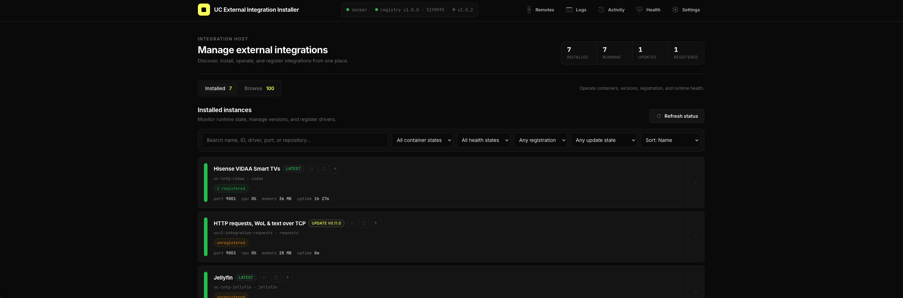
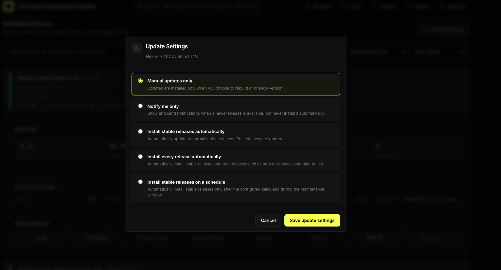
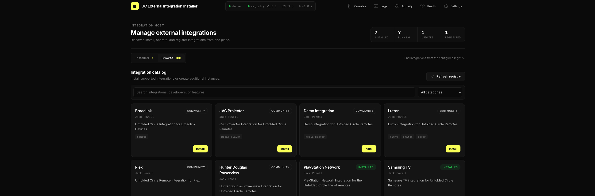
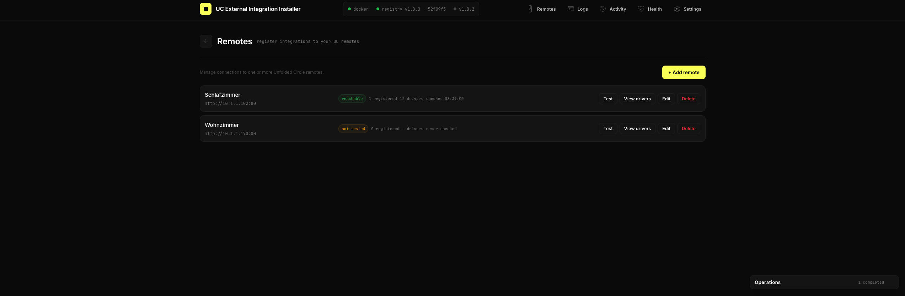
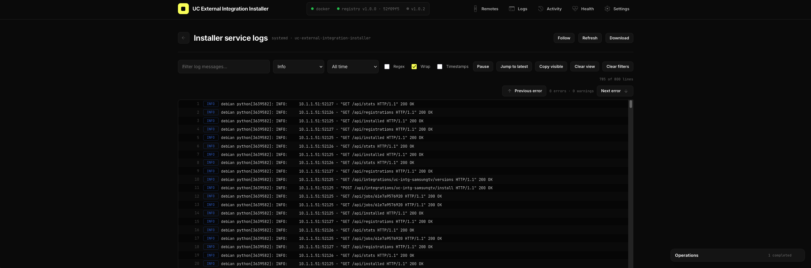
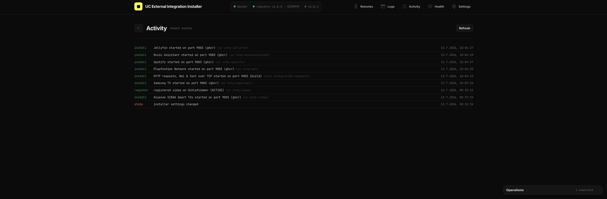
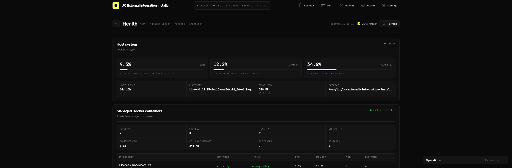
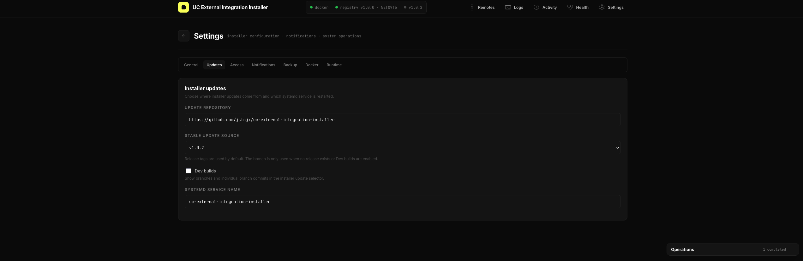

# UC External Integration Installer

A self-hosted web application for installing, configuring, updating, monitoring, and managing **Unfolded Circle external integrations**.

The installer provides a browser-based interface for managing integration instances, registering drivers on UC remotes, viewing logs and health data, maintaining Docker resources, and updating the installer itself.




## Quick Navigation

- [Features](#features)
- [Registry](#registry)
- [Installation](#installation)
- [Updating](#updating)
- [Uninstalling](#uninstalling)
- [Web interface](#web-interface)
- [Notifications](#notifications)
- [Integration installation](#integration-installation)
- [Configuration](#configuration)
- [Security](#security)
- [Project structure](#project-structure)
- [REST API](#rest-api)
- [License](#license)

---

## Features

- Browse and search the external integration registry
- Install from prebuilt GHCR images or build from source
- Run multiple instances of the same integration
- Start, stop, restart, rebuild, configure, and remove integrations
- Select integration versions and configure update policies
- Register and unregister drivers on multiple UC remotes
- Detect remote availability before registration
- View live container statistics and integration health
- View installer and integration logs with search, filters, time ranges, and live follow
- Monitor host, Docker, remote, and installer health
- View support diagnostics
- Track active, completed, and failed operations
- Configure webhook notifications
- Back up and restore installer state
- Reconcile managed containers and prune Docker build data
- Update the installer from stable releases or optional development builds
- Responsive desktop and mobile interface
- Optional bearer-token authentication

## Registry

This project uses [Jack Powell's `uc-intg-list` repository](https://github.com/JackJPowell/uc-intg-list) as its default source for the external integration catalog.

Default registry URL:

```text
https://raw.githubusercontent.com/JackJPowell/uc-intg-list/refs/heads/main/registry.json
```

The registry, its entries, and their metadata are maintained separately from this project.

The registry source can be changed in **Settings** or with the `UC_REGISTRY_URL` environment variable.

## Installation

```bash
curl -fsSL https://raw.githubusercontent.com/jstnjx/uc-external-integration-installer/main/install.sh | sudo bash
```

After installation, open:

```text
http://<host-ip>:8900
```

Complete the first-time setup wizard. When releases are available, the newest stable release is selected as the default installer update source.

## Updating

The installer can update itself from the web interface.

Stable GitHub releases are shown by default. Development branches and individual branch commits can be enabled with **Settings → Updates → Dev builds**.

The updater can install:

- Stable release tags
- The latest commit from an enabled branch
- An individual commit from an enabled branch

The currently installed release, branch, or commit is shown in the header and preselected in the update page.

You can also rerun the installer:

```bash
curl -fsSL https://raw.githubusercontent.com/jstnjx/uc-external-integration-installer/main/install.sh | sudo bash
```

Installed integration containers and configuration are preserved.

## Uninstalling

```bash
curl -fsSL https://raw.githubusercontent.com/jstnjx/uc-external-integration-installer/main/uninstall.sh | sudo CONFIRM=1 bash
```

Unregister drivers from your UC remotes before uninstalling if you do not want registrations left behind.

## Web interface

### Installed

The default page for operating installed integration instances.


- Runtime state and resource usage
- Lifecycle controls
- Version management
- Update policies
- Remote registration
- Bulk actions
- Configuration
- Logs
- Backup and restore
- Rebuild and removal



### Browse

Browse and install supported entries from the configured registry.



### Remotes

Manage UC remotes and their drivers.



- Add and edit remotes
- Test reachability
- View bundled, external, and custom drivers
- Register and unregister integrations
- Detect unavailable remotes before registration

Remote credentials are stored in the installer data directory. Keep that directory private.

### Logs

View installer-service or integration-container logs.



- Live follow
- Text and regular-expression search
- Severity filters
- Time-range filters
- Saved log views
- Error navigation
- Copy and download

### Activity

View recorded installer events such as installs, updates, registrations, removals, settings changes, and maintenance operations.



### Health



Displays:

- Host CPU, memory, disk, load, and uptime
- Statistics for installer-managed Docker containers
- UC remote reachability and latency
- Installer process, registry, job, and error statistics

### Settings



Configure:

- Integration port range
- Registry source
- Stable and development update sources
- Installer service settings
- Health probing
- API authentication
- Notifications
- Backup and restore
- Settings export and import
- Docker reconciliation and pruning
- Runtime diagnostics

## Notifications

Webhook notifications can be enabled per event category.

Supported formats include:

- Discord webhooks
- ntfy
- Slack-compatible or generic JSON webhooks

Notifications include event type, host, timestamp, integration name, instance ID, and other relevant context where available.

## Integration installation

Each integration runs as an installer-managed Docker container using host networking.

The installer attempts installation in this order:

1. Pull a prebuilt GHCR image
2. Build with the repository's Dockerfile
3. Use a built-in language-specific builder
4. Fall back to Nixpacks when available

Persistent configuration is stored below:

```text
/var/lib/uc-external-integration-installer/config/
```

The data directory can be changed with `UC_INSTALLER_DATA`.

## Configuration

Most configuration is available in the web interface.

Environment variables provide installation-time defaults:

| Variable | Default | Description |
| --- | --- | --- |
| `UC_INSTALLER_HOST` | `0.0.0.0` | Web UI bind address |
| `UC_INSTALLER_PORT` | `8900` | Web UI port |
| `UC_INSTALLER_DATA` | `/var/lib/uc-external-integration-installer` | State, configuration, backups, and source data |
| `UC_INSTALLER_TOKEN` | empty | Optional bearer token |
| `UC_PORT_START` | `8000` | First automatically assigned integration port |
| `UC_REGISTRY_URL` | `uc-intg-list` registry | Integration registry URL |
| `UC_INSTALLER_UPDATE_REPO` | this repository | Installer update repository |
| `UC_INSTALLER_UPDATE_BRANCH` | `main` | Branch fallback when no release is available |
| `UC_INSTALLER_SERVICE` | `uc-external-integration-installer` | systemd service name |
| `UC_INSTALLER_ALERT_WEBHOOK` | empty | Default webhook URL |
| `UC_INSTALLER_HEALTH_PROBE` | `1` | Set to `0` to disable integration health probes |

## Security

The installer controls Docker and should be treated as a privileged administration service.

- Enable an access token on shared networks
- Do not expose port `8900` directly to the public internet
- Use a reverse proxy with HTTPS for remote access
- Protect the installer data directory because it can contain remote credentials and integration secrets

## Project structure

```text
uc-external-integration-installer/
├── uc_installer.py
├── install.sh
├── uninstall.sh
├── requirements.txt
├── static/
│   ├── index.html
│   ├── styles.css
│   ├── api.js
│   ├── app.js
│   ├── navigation.js
│   ├── dialogs.js
│   ├── installed.js
│   ├── remotes.js
│   ├── logs.js
│   ├── settings.js
│   ├── operations.js
│   ├── enhancements.js
│   ├── health.js
│   └── favicon.svg
├── LICENSE
└── README.md
```

## REST API

The web interface uses the same REST API that is available for automation.

When authentication is enabled:

```http
Authorization: Bearer <token>
```

Interactive OpenAPI documentation is available at:

```text
http://<host-ip>:8900/docs
```

### Health and diagnostics

| Method | Endpoint | Description |
| --- | --- | --- |
| `GET` | `/api/health` | Basic service health |
| `GET` | `/api/health/overview` | Host, Docker, remote, and installer health |
| `GET` | `/api/diagnostics` | Support diagnostics |
| `GET` | `/api/stats` | Managed-container runtime statistics |

### Setup and settings

| Method | Endpoint | Description |
| --- | --- | --- |
| `GET` | `/api/setup` | First-run and runtime setup data |
| `GET` | `/api/settings` | Read general settings |
| `PUT` | `/api/settings` | Update general settings |
| `GET` | `/api/settings/alerts` | Read notification settings |
| `PUT` | `/api/settings/alerts` | Update notification settings |
| `POST` | `/api/settings/alerts/test` | Send a test notification |
| `GET` | `/api/settings/export` | Export settings without secrets |
| `POST` | `/api/settings/import` | Import settings |

### Registry and versions

| Method | Endpoint | Description |
| --- | --- | --- |
| `GET` | `/api/registry` | Read the integration registry |
| `GET` | `/api/updates` | Check installed integration updates |
| `GET` | `/api/integrations/{id}/versions` | List available integration versions |

### Installed integrations

| Method | Endpoint | Description |
| --- | --- | --- |
| `GET` | `/api/installed` | List installed instances |
| `POST` | `/api/integrations/{id}/install` | Install an integration |
| `POST` | `/api/integrations/{id}/add-instance` | Add another instance |
| `POST` | `/api/integrations/{id}/config` | Configure the default instance |
| `POST` | `/api/integrations/{id}/{start\|stop\|restart}` | Control the default instance |
| `DELETE` | `/api/integrations/{id}` | Remove the default instance |
| `POST` | `/api/instances/{id}/{start\|stop\|restart}` | Control an instance |
| `POST` | `/api/instances/{id}/config` | Reconfigure an instance |
| `POST` | `/api/instances/{id}/rebuild` | Rebuild an instance |
| `POST` | `/api/instances/{id}/auto-update` | Update the instance update policy |
| `DELETE` | `/api/instances/{id}` | Remove an instance |
| `POST` | `/api/install-archive` | Install a supported release archive |

### Logs and operations

| Method | Endpoint | Description |
| --- | --- | --- |
| `GET` | `/api/installer/logs` | Read installer logs |
| `GET` | `/api/installer/logs/stream` | Stream installer logs |
| `GET` | `/api/instances/{id}/logs` | Read integration logs |
| `GET` | `/api/instances/{id}/logs/stream` | Stream integration logs |
| `GET` | `/api/events` | Read activity history |
| `GET` | `/api/jobs/{job_id}` | Read an asynchronous job |
| `GET` | `/api/operations` | Read persisted operation history |

### Remotes and drivers

| Method | Endpoint | Description |
| --- | --- | --- |
| `GET` | `/api/remotes` | List remotes |
| `POST` | `/api/remotes` | Add a remote |
| `PUT` | `/api/remotes/{id}` | Update a remote |
| `DELETE` | `/api/remotes/{id}` | Remove a remote |
| `POST` | `/api/remotes/{id}/test` | Test remote connectivity |
| `GET` | `/api/remotes/{id}/drivers` | List remote drivers |
| `POST` | `/api/remotes/{id}/register/preflight` | Validate a registration |
| `POST` | `/api/remotes/{id}/register` | Register an integration |
| `DELETE` | `/api/remotes/{id}/drivers/{driver_id}` | Unregister a driver |
| `GET` | `/api/registrations` | Read registration state |

### Backup and maintenance

| Method | Endpoint | Description |
| --- | --- | --- |
| `GET` | `/api/backup` | Download a backup |
| `POST` | `/api/restore` | Restore a backup |
| `POST` | `/api/maintenance/reconcile` | Reconcile managed containers and state |
| `POST` | `/api/maintenance/prune` | Prune selected Docker data |

### Installer updates

| Method | Endpoint | Description |
| --- | --- | --- |
| `GET` | `/api/update/status` | Read installed and available update state |
| `GET` | `/api/update/builds` | List releases, branches, and branch commits |
| `POST` | `/api/update/apply` | Install a selected release, branch, or commit |
| `POST` | `/api/update/restart` | Restart the installer service |

## License

This project is licensed under the MIT License. See [LICENSE](LICENSE).

